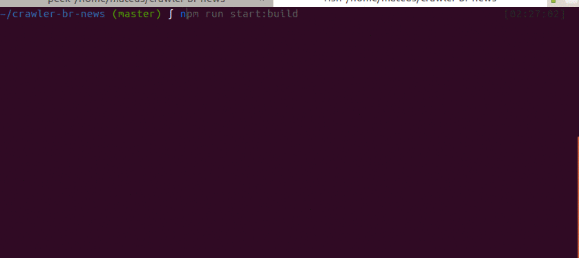

# :newspaper:  crawler-br-news

A crawler to get news from a brazilian website.

Creating this project to learn and implement a crawler in nodejs.

### How to install crawler-br-news?

To run this project, just run the below commands. Assuming you have nodejs installed.

```sh
$ git clone https://github.com/mateusduraes/crawler-br-news.git
$ cd crawler-br-news
$ npm install
```

### How to execute crawler-br-news?

```sh
$ npm run start:build
```

The output will look like the below image.




### ToDO List

* Make it a command line interface.
* Write tests.
